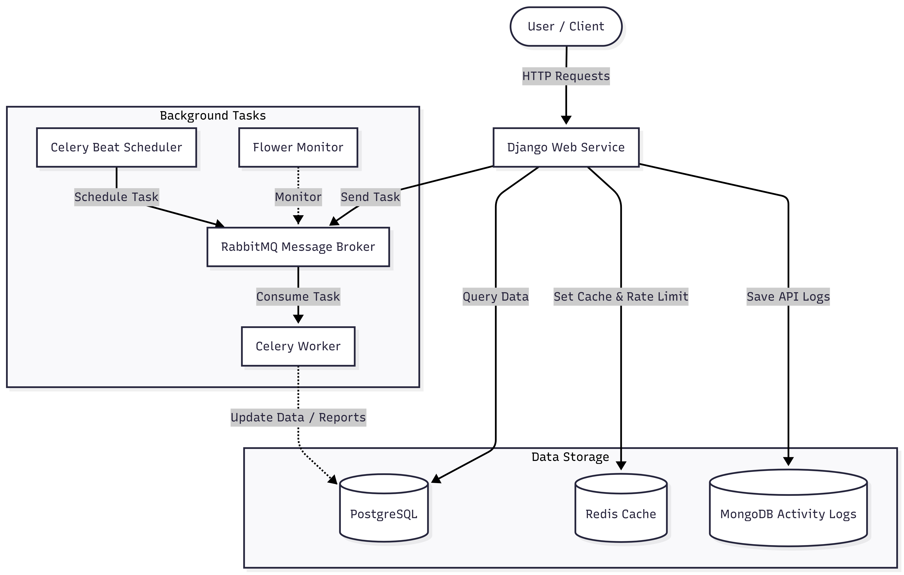

# Simple LMS - Advanced API Features

Proyek ini adalah sistem Learning Management System (LMS) sederhana yang dibangun dengan **Django Ninja** dan dijalankan sepenuhnya menggunakan **Docker Compose**. 

Pada fase lanjutan ini, proyek telah diintegrasikan dengan arsitektur *microservices* modern menggunakan **Redis, RabbitMQ, Celery, MongoDB, dan Flower** untuk menangani *caching*, *rate limiting*, tugas latar belakang (*background tasks*), dan pencatatan aktivitas (*activity logging*).

## 1. Architecture Diagram

**Penjelasan Alur Arsitektur:**
Sistem ini menggunakan arsitektur *Microservices-oriented* yang memisahkan beban kerja ke beberapa komponen spesifik:
- **Client & API (Django)**: Bertindak sebagai otak utama yang merespon HTTP *request* secara langsung.
- **Data Storage Tier**: Menggunakan **PostgreSQL** (relasional), **Redis** (*In-Memory* untuk Cache & Rate Limit), dan **MongoDB** (NoSQL khusus untuk Activity Logs).
- **Background Tasks Tier**: API melempar tugas berat ke **RabbitMQ** (Message Broker). **Celery Worker** mengeksekusi antrean tugas di latar belakang, **Celery Beat** mengatur tugas terjadwal, dan **Flower** memonitor semuanya.

## 2. Caching Strategy Explanation
Sistem ini menggunakan strategi **Cache-Aside Pattern** dengan bantuan Redis:
1. **Cek Cache**: Saat *user* meminta data (contoh: daftar kursus), sistem pertama kali akan mencari data tersebut di dalam memori Redis.
2. **Cache Hit**: Jika data ditemukan di Redis, sistem langsung mengembalikannya ke *user* dengan sangat cepat tanpa perlu menyentuh *database* PostgreSQL.
3. **Cache Miss**: Jika data tidak ada di Redis, sistem akan melakukan *query* ke PostgreSQL, lalu **menyimpan salinan hasilnya ke Redis** (dengan waktu kedaluwarsa/TTL 15 menit). *Request* berikutnya akan dilayani langsung oleh Redis.

**Bukti Pengujian Caching & Rate Limiting (Redis):**

## 3. Task Flow Documentation
Sistem memiliki 4 tugas Celery (*background tasks*) dengan alur operasional sebagai berikut:
1. **`export_course_report` (Manual Asinkron)**: Dipicu oleh *user* via API `/api/analytics/export/`. API memberikan respon instan kepada *user*, sementara Celery menyusun laporan CSV di latar belakang.
2. **`send_enrollment_email` (Otomatis Asinkron)**: Terpicu saat *user* mendaftar kursus (`/api/courses/{id}/enroll`). API langsung merespon "Berhasil mendaftar", sedangkan proses pengiriman *email* dilempar ke RabbitMQ untuk ditangani oleh Worker.
3. **`generate_certificate` (Otomatis Asinkron)**: Terpicu saat meminta sertifikat (`/api/courses/{id}/certificate`). Pembuatan PDF sertifikat yang memakan waktu lama diproses oleh Celery tanpa memblokir koneksi *user*.
4. **`update_course_statistics` (Terjadwal / Periodic)**: Tidak dipicu oleh *user*. Mesin **Celery Beat** bertugas melempar tugas ini ke RabbitMQ secara otomatis setiap 1 menit. Worker kemudian mengeksekusinya untuk memperbarui data statistik di *database*.

**Bukti Pengujian Task Flow (Celery & Flower):**

**Bukti Pengujian Activity Logger (MongoDB):**

---
*Proyek ini merupakan bukti implementasi nyata integrasi sistem basis data SQL, NoSQL, In-Memory Caching, dan Message Broker pada arsitektur web modern.*
